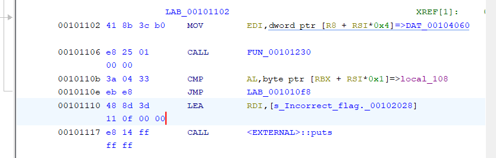

# ctfd-plus

Reverse Engineering

## Understanding the Binary

The Binary Ninja Pseudo C code of `main` is as follows

```c
int32_t main(int32_t argc, char** argv, char** envp)
{
    puts("Welcome to CTFd+!");
    puts("So far, we only have one challen…");
    puts("Very Doable Pwn - 500 points, 0 …");
    puts("Can you help me pwn this program…");
    puts("#include <stdio.h>\nint main(voi…");
    puts("Enter the flag:");
    void buf;
    fgets(&buf, 0x100, stdin);
    int64_t rsi = 0;
    *(uint8_t*)(&buf + strcspn(&buf, &data_2026)) = 0;
    while (true)
    {
        if (sub_1230(*(uint32_t*)(&data_4060 + (rsi << 2))) != *(uint8_t*)(&buf + rsi))
        {
            puts("Incorrect flag.");
            break;
        }
        rsi = (rsi + 1);
        if (rsi == 0x2f)
        {
            puts("You got the flag! Unfortunately …");
            break;
        }
    }
    return 0;
}
```

This may not be clear at first glance but in short, we want to reach the branch that prints "You got the flag! Unfortunately …" because this implies that we entered the flag as input. 

Unfortunately, with the pseudo C code, we are unable to figure out how to modify the functionality of the binary such that the characters that the input is being compared against instead get printed. To that end, we need to dive into some assembly. 

## Overview of the Assembly of the Loop in `main`

The following image taken from Binary Ninja's graphical view shows the x86-64 assembly instructions involved in the loop in `main`


We see that the call to `sub_1238` with first argument the value at the memory location `[r8+rsi*4]` is the process that generates the byte which is compared with a character from our input buffer. 

We need to attempt to reverse `sub_1238`. Instead, if we let `sub_1238` generate all the characters of the flag without breaking out of the loop, then we will be able to obtain the flag!

## Patching the Binary to ensure Flag is fully generated

From the image above, notice the `je` instruction (at address `0x110e`) which will only continue the loop if our input character matches the character of the flag at the same index. To ensure the loop run until the whole flag is printed (i.e. until `rsi = 0x2f`) we patch the `je` instruction with a `jmp` instruction. 

This can be done in Ghidra, by right-clicking the instruction to be patched and selecting *Patch Instruction*


Notice that Ghidra adds 0x100000 to the value of the original address. 

It is important to patch with an instruction of the same length so that the references to functions through addresses, etc are not broken. Outcome: 



Finally, export the binary to your directory of choice with **File > Export Program**, choosing to export as "Original File". 

## GDB Scripting to get the flag

We've patched the binary, but this is not enough. The value of `al` is always overwritten and not accumulated into a string that we can print as the flag. 

This is where GDB scripting comes in. Note that gef does not allow for continue commands to be executed automatically upon hitting a breakpoint as part of a script, so we run

```bash
gdb -nx ctfd-plus_patched
```

to run GDB without gef. 

### General Concept of Script

The general concept of the script is that, upon hitting the instruction at 0x110b (i.e. the instruction where the comparison between a char from our input string and the correct flag is done), we want to store the byte in `al` into our input buffer. 

We automate this by running a script that runs automatically every time the breakpoint is hit. 

> Since this technically makes both bytes equal, we did not need to patch the binary to remove the `je` (jump if equal) instruction. But hey, on the bright side, it's a good experience to have gone through :) 

### Implementation

We first obtain the base address where the binary is loaded. In gdb, this can be done with `info proc maps` and taking the starting address of the first section. 

Alternatively, in gef, run

```gef
gef➤  p $_base()
$1 = 0x555555554000
```

By default, gdb disables all ASLR and the base address for 64-bit executables is always 0x555555554000. 

We then set a breakpoint at `0x555555554000 + 0x110b` and find the breakpoint number by listing breakpoints with `i b`. The command we want to run every time that breakpoint is hit (before continuing) is

```gdb
(gdb) set {char}($rbx+$rsi*1) = $al
```

This is done using the `commands <bp_num>` command. We therefore write

```gdb
(gdb) commands 1
> set {char}$rbx+$rsi*1 = $al
> c
> end
```

Lastly, we set a breakpoint at a point after all of the flag has been saved, continue, and profit

```gdb
(gdb) b *0x555555554000+0x1127
(gdb) c
(gdb) x/s $rbx
0x7fffffffdc70: "lactf{m4yb3_th3r3_1s_s0m3_m3r1t_t0_us1ng_4_db}"
```

## Flag

```
lactf{m4yb3_th3r3_1s_s0m3_m3r1t_t0_us1ng_4_db}
```
