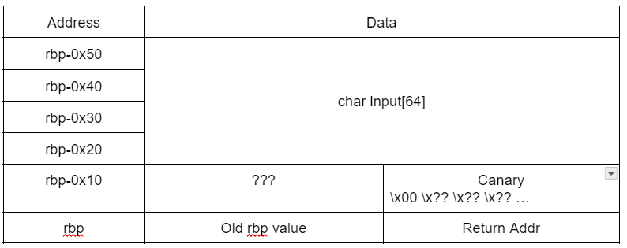

# aplet123
In short, aplet123 is a stack-smashing ret2win challenge with a canary and no PIE. 

## Source files
You will find the binary at `docker/aplet123` and the source file at `docker/aplet123.c`. 

## Inspecting the Source Code
The use of the `gets()` function (that permits buffer overflows) is great indication that the stack may be able to be smashed. 

```c
int main(void) {
  setbuf(stdout, NULL);
  srand(time(NULL));
  char input[64];
  puts("hello");
  while (1) {
    gets(input);
    char *s = strstr(input, "i'm");
    if (s) {
      printf("hi %s, i'm aplet123\n", s + 4);
    } else if (strcmp(input, "please give me the flag") == 0) {
      puts("i'll consider it");
      sleep(5);
      puts("no");
    } else if (strcmp(input, "bye") == 0) {
      puts("bye");
      break;
    } else {
      puts(responses[rand() % (sizeof responses / sizeof responses[0])]);
    }
  }
}
```

Noting that win function also present in the source code, 

```c
void print_flag(void) {
  char flag[256];
  FILE *flag_file = fopen("flag.txt", "r");
  fgets(flag, sizeof flag, flag_file);
  puts(flag);
}
```

our task has become pretty clear - smash the stack, mutate the return address, and win. 

## checksec
Running checksec on aplet123, we obtain 

```bash
[*] '/mnt/d/CTFs/LACTF 2024/aplet123/docker/aplet123'
    Arch:     amd64-64-little
    RELRO:    Partial RELRO
    Stack:    Canary found
    NX:       NX enabled
    PIE:      No PIE (0x400000)
```

Since this challenge is simply a ret2win stack-smashing challenge, the main area of concern is merely the stack canary, which we need to overwrite correctly. 

This implies that we will need to leak the canary to overflow the stack without getting detected. As there is no PIE, we need not leak an address to obtain address offsets - the static address can be directly used. 

## Leaking the Canary
Leaking the canary involves leveraging this section of code

```c
gets(input);
char *s = strstr(input, "i'm");
if (s) {
    printf("hi %s, i'm aplet123\n", s + 4);
}
```

because we get to leak the string starting 4 bytes away from the start of where `"i'm"` is injected into memory

### Understanding the Structure of the Stack
From the disassembly of `main` using gdb, we find the following

```x86asm
0x0000555555555397 <+79>:    lea    rax,[rbp-0x50]
0x000055555555539b <+83>:    mov    rdi,rax
0x000055555555539e <+86>:    mov    eax,0x0
0x00005555555553a3 <+91>:    call   0x555555555190 <gets@plt>
```

This means that `gets()` writes our input into the address given by `rbp-0x50`. 

From the `main()` source code, we know that our input buffer is 64 (0x40) bytes long, so there are 16 more bytes of memory before the base pointer. 

The instructions below then tell us where the canary is

```x86asm
0x000055555555534c <+4>:     push   rbp
0x000055555555534d <+5>:     mov    rbp,rsp
0x0000555555555350 <+8>:     sub    rsp,0x60
0x0000555555555354 <+12>:    mov    rax,QWORD PTR fs:0x28
0x000055555555535d <+21>:    mov    QWORD PTR [rbp-0x8],rax
```

Note that the first instruction that pushes `rbp` is part of setting up the current stack frame - `rbp` now points to the old `rbp` value, but those bytes are not part of the 16 bytes we are investigating. 

It is the last two instructions that tell us that the canary starts at `rbp-0x8`. 

### Combining the Means with the Vulnerability
First, note that canaries almost always begin with the null byte. Thus, to leak the canary, we need to read from `rbp-0x7` onwards. 

Let us then review our current understanding of the stack shown below



Recall that we can leak an address an increment of 4 away from where `"i'm"` begins. Thus, if we overflow `input` such that `"i'm"` ends the `rbp-0x10` doubleword, we will leak the string starting from  `rbp-0x7`, which is `rbp-0xb + 4`! 

In other words, we will be able to leak the canary :)

### Payload to Leak the Canary
To create the input to leak the canary, we use the Python command

```
python3 -c "print('A'*(64+5)+'i\'m')"
```

## Creating the Final Payload

Since the code runs in a while loop (that does not terminate when entering the branch required to [leak the canary](#leaking-the-canary)), we can send a preliminary payload to leak the canary, before crafting the final payload that overwrites the return address. 

The following sections describe the concept of each segment of the payload. You will the find the exact implementation in `solve.py`. 

Referring to the stack visualization diagram presented earlier will likely be beneficial. 

### Pre-canary Segment
Branching in the while loop requires that our input begins with `b'bye\x00'` so that the `strcmp` function will pass, before we pad until reaching the canary. 

### Canary Segment
This segment is simply the 8-byte canary as leaked, where the first byte is the null byte. 

### Post-canary Segment
This segment completes the payload with 8 bytes of padding before the return address that can be statically found using gdb. 
