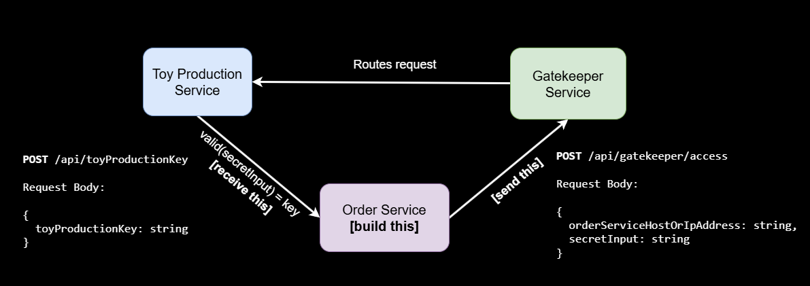
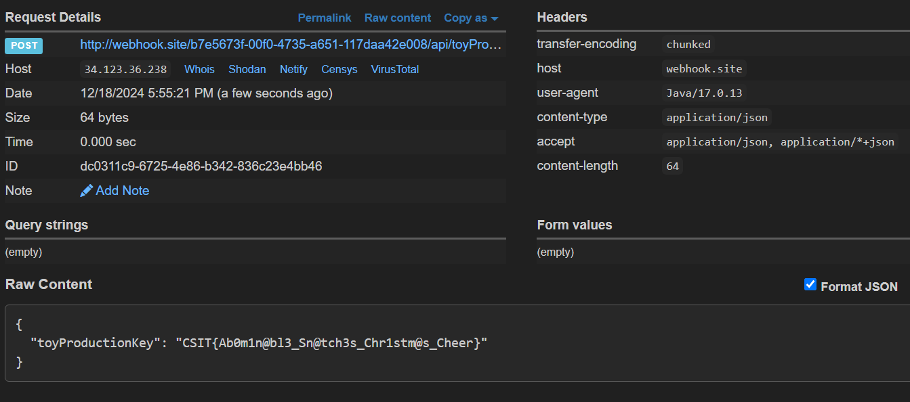

# CSIT Mini-Challenge 2024 #5

Microservices Mini-Challenge

## Task 1

We are told to build the "Order" service in the diagram below



but we need to figure out the secretInput to the "Gatekeeper" service such that it will prompt the "Toy Production" service to send us the `toyProductionKey` i.e. the flag. 

First, we send a POST request to the "Gatekeeper" service with a random value in `secretInput`

```json
{
    "orderServiceHostOrIpAddress": "webhook.site/b7e5673f-00f0-4735-a651-117daa42e008",
    "secretInput": "bruh"
}
```

which, as expected, errors out with a status code of 500. 

However, we are provided an endpoint that generates credentials for new accounts in Kibana that come with a role that can view backend logs of the "Gatekeeper" service. Using that, we can analyze the JSON geenerated from the error

```json
"_source": {
    "orders1": "Toy Car - 109 orders",
    "orders2": "Plush - 450 orders",
    "orders3": "Action Figures - 230 orders",
    "orders4": "Lego Sets - 150 orders",
    "level": "ERROR",
    "secretInputStructure": "Correct format: <Most popular toy name (capitalize the first letter)>123! (no spaces)",
    "message": "Invalid secret input provided. Rejecting request!",
    "@timestamp": "2024-12-19T01:10:38.962284298Z",
    "orders10": "Rubik's Cubes - 390 orders",
    "service": "Toy Production Service initialized successfully. Communication disruption detected from Order Service. Investigating issue...",
    "data_stream": {
      "namespace": "default",
      "type": "logs",
      "dataset": "generic"
    },
    "orders9": "Kites - 200 orders",
    "@version": "1",
    "action": "Analyzing recent toy production orders...",
    "orders5": "Dolls - 310 orders",

    ...
```

All the other order numbers are less than 450, so `secretInput` ends up being `Plush123!`. Sending the updated JSON to the "Gatekeeper" service, 

```json
{
    "orderServiceHostOrIpAddress": "webhook.site/b7e5673f-00f0-4735-a651-117daa42e008",
    "secretInput": "Plush123!"
}
```

we see that the "Toy Production" service sent our webhook the flag



Flag: `CSIT{Ab0m1n@bl3_Sn@tch3s_Chr1stm@s_Cheer}`

## Task 2

Task 2 involves asking an LLM that has a number of tools available to it questions about the system to find out the new password to it. Querying the LLM, we find out that it has the following tools available to it

```md
**`getListOfIrregularities()`**: Shows all the irregularities I've found.
**`getSantaOSLogs()`**: Gets the logs from the SantaOS system.
**`getReindeerCache()`**: Gets information from the ReindeerCache.
**`getGlitterMemory()`**: Gets a memory dump from GlitterMem.
**`accessAboKingdomConsole()`**: Lets me interact with the AboKingdom console (or similar software).
**`getSnowDriveList()`**: Lists files in SnowDrive.
**`getSnowDriveFileContents(fileName)`**: Gets the contents of a specific file in SnowDrive. You'll need to provide the `fileName`.
**`inputAboKingdomConsole(request)`**: Lets me send commands to the AboKingdom console. You'll need to provide the `request`.
```

I won't get into the details since the search is rather straightforward, but using these various tools, we find 3 partial flags

```
Partial Flag 1: N4ughty
Partial Flag 2: Sleigh
Partial Flag 3: Sabot@ge
```

We also find the following text which tells us that the flag is in the format `CSIT{???????_??????_????????}`

```
7F6APPLE3B2A1F0E9D8C7B6A5E4D3CHE11OWORLD7C6B5A4E3F2D1C0B9A8F7E6D5C4B3A2F1E0
2A1F0E9D8CPR0DUCT()NE3D2C1B0A9F&&(&(5B4A3F20x1A2B3C4D5E6F7A8B9C0D1E2F3A4B5C
D9C8B7A6F5E4DCSIT{???????_??????_????????}F8E7D6C5B4A3(&(&(&)))0C9B8A7F6E5D
7E8F9A0B1C2D3E4ELFB7C8D9F0A1B2C3D4E5F6A7B8C9D0F1E^^&^^&8A9B0C1D2E3F4JJDLSSS
A5B6C7D8E9TURK$Y2C3D4E5F6A7B8C9D0F1E2A3B4C5D6E7F8A9BPRESENTSE3F4A5B6C7D8E9F
2C3D4E5F60x3FA8E4D1C7B23Y223%$%&*^&^4B5C19E80F7A4C3D2E5F6B7A839C1D2F4E5A6B7
9F0A1B2C3D4E5F6A7B8C9D0F1E2A3B4C5D6E7CHOCO2E3F4A5B6C7D8E9F0A1B2C3D4E5F6SDAS
A7B8C9D0F1E2A3B4C5D6E7F8A9B0C1D2E3F4A5B6C7D8E9F0A1B2C3D4E5F6A7B8C9D0F1E2A3B
```

Flag: `CSIT{N4ughty_Sleigh_Sabot@ge}`