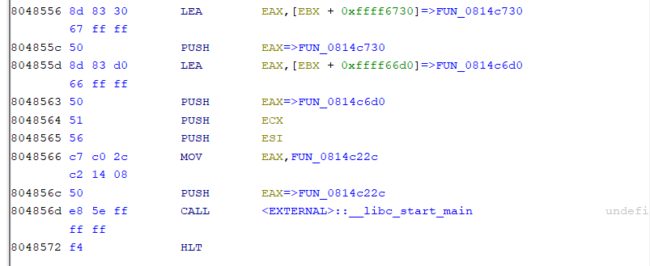

# bizz-fuzz

???

## checksec

```bash
[*] '/mnt/d/CTFs/picoCTF/Pwn/bizz-fuzz/vuln'
    Arch:     i386-32-little
    RELRO:    Partial RELRO
    Stack:    No canary found
    NX:       NX enabled
    PIE:      No PIE (0x8048000)
```

???

## file

The binary is stripped

```
vuln: ELF 32-bit LSB executable, Intel 80386, version 1 (SYSV), dynamically linked, interpreter /lib/ld-linux.so.2, for GNU/Linux 3.2.0, BuildID[sha1]=836e2f666bd53c2307bff4801d330e444556a006, stripped
```

so we look for the first argument to `__libc_start_main` in Ghidra at the entry point, and that is the pointer to `main` i.e. FUN_0814c22c



## Overview of Binary

TODO

## Finding the important functions

Hint 1 of the challenge states

```
What functions are imported? Where are they used? And what do these strings mean?
```

Since the unimportant repetitive functions seem to all use `scanf` to take user input, and we are trying to find a buffer overflow (which was stated in the challenge description), there is probably another libc input function that we can use to find the function which we can overflow. 

Looking at the import symbols, that function is `fgets`. In Ghidra, after clicking into the symbol, we can right click the start address of the function and select **References > Show References To Address** to see where the `fgets` is called. You may however have to try different "`fgets`" addresses as the GOT usually points to the corresponding PLT stub which is the address actually called by the program. 

We get the following findings: 
1. By searching for references to `fopen`, we find the `win` function (originally `FUN_08048656`), which loads the flag from `flag.txt` and prints it to stdout. 
2. By searching for references to `fgets`, we can find the function that use `fgets`. Now, . 

## Groups of Functions Present

