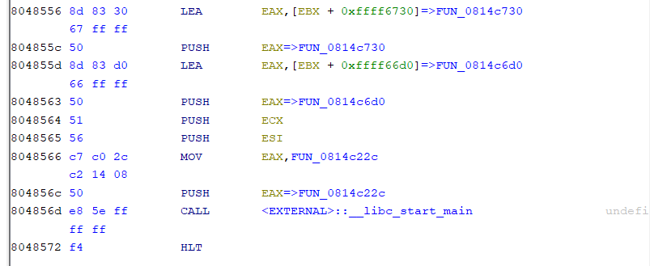

# bizz-fuzz

Binary Instrumentation, Search for Buffer Overflow in ELF Binary

## checksec

```bash
[*] '/mnt/d/CTFs/picoCTF/Pwn/bizz-fuzz/vuln'
    Arch:     i386-32-little
    RELRO:    Partial RELRO
    Stack:    No canary found
    NX:       NX enabled
    PIE:      No PIE (0x8048000)
```

No canary protection for stack smashing

No PIE, so we can overwrite the return address with a fixed win address

## file

`file` tells us that the binary is stripped, as shown

```
vuln: ELF 32-bit LSB executable, Intel 80386, version 1 (SYSV), dynamically linked, interpreter /lib/ld-linux.so.2, for GNU/Linux 3.2.0, BuildID[sha1]=836e2f666bd53c2307bff4801d330e444556a006, stripped
```

so we look for the first argument to `__libc_start_main` in Ghidra at the entry point, and that is the pointer to `main` i.e. FUN_0814c22c



## Overview of Binary

There are two groups of functions with nested calls in the binary, which are
1. a group of functions which calls a sort of `fizzBuzz` function (that returns the number) repeatedly to determine (based on the correctness of each playing of fizzBuzz up to a certain number) the next function that will be entered, and
2. another group of functions which calls `fizzBuzz` once to determine, based on the number of correct responses for that one play of fizzBuzz, which call to `fgets` is used. The calls to `fgets` accept varying input lengths. 

> How this was realized is covered in [Finding the important functions](#finding-the-important-functions)

The functions in Group 1 only accept input through the `fizzBuzz` function which calls `scanf`, but `fizzBuzz` does not expose a buffer overflow vulnerability. Therefore the buffer overflow vulnerability must occur in one of the function in Group 2, where `fgets` is called with a input size larger than the buffer size. 

### How large is our search space?

It is not possible to conduct the search manually, as the CFGFast (control flow graph) of the binary loaded in angr, without loading libc, has a whopping 119785 nodes

```python
>>> proj = angr.Project('./vuln', auto_load_libs=False)
>>> cfg = proj.analyses.CFGFast()
>>> len(cfg.graph.nodes())
119785
```

## Finding the important functions

Hint 1 of the challenge states

```
What functions are imported? Where are they used? And what do these strings mean?
```

Since the functions in Group 1 seem to all use `scanf` (in `fizzBuzz`) to take user input (in which no overflow occurs), and we are trying to find a buffer overflow (which was stated in the challenge description), there is probably another libc input function that we can use to find the function which we can overflow. 

Looking at the import symbols, that function is `fgets`. In Ghidra, after clicking into the symbol, we can right click the start address of the function and select **References > Show References To Address** to see where the `fgets` is called. You may however have to try different "`fgets`" addresses as the GOT address is referenced by the corresponding PLT stub which only then actually referenced by the program. 

We get the following findings: 
1. By searching for references to `fopen`, we find the win function (originally `FUN_08048656`), which loads the flag from `flag.txt` and prints it to stdout. 
2. By searching for references to `fgets`, we can find the functions that use `fgets`. This includes the win function, but also a group of functions (i.e. Group 2), one of which likely allows for overflow. 

## Finding the Overflow

### Attempt with angr

The typical way of finding a buffer overflow with angr is to symbolically execute the binary to search for unconstrained states (i.e. states where the instruction pointer becomes symbolic), as shown

```python
import angr
proj = angr.Project('vuln', auto_load_libs=False)
simgr = proj.factory.simulation_manager(save_unconstrained=True)
while len(simgr.unconstrained)==0:
    simgr.step()
```

However, due to the very large search space resulting in many active states (or deferred states, if you are using DFS), the Python script keeps getting killed on my computer. 

What works is to instead use `objdump` and `grep` the output, since the various setup and calls to `fgets` are all identical in terms of their assembly instructions (less the number of bytes to read). 

### Using `objdump`

Hint 3 of the challenge states that `objdump` should be considered

```
If fancy new dissassemblers take too long, there's always objdump!
```

Admittedly, I took the following command from [this writeup](https://activities.tjhsst.edu/csc/writeups/picoctf-2021-bizz-fuzz), which displays human-readable assembly in the text segment in Intel syntax and `grep`s for the argument pushed to `fgets`, 


```bash
objdump -j .text -d -Mintel vuln | grep -B 3 fgets | grep 'push   0x'
```

but I added some sorting functionality so that the push instruction we're interested in comes to the fore immediately (the bash cmds just prepend the pushed value to each line before using that value for sorting)

```bash
objdump -j .text -d -Mintel vuln | grep -B 3 fgets | grep 'push   0x' | awk '{print strtonum($(NF)), $0}' | sort -k1,1n | tail -n 1
```

Output: 

```
348  808aea7:   68 5c 01 00 00          push   0x15c
```

In Ghidra, we see that this statement is part of a function that certainly is vulnerable to buffer overflow

```c
void FUN_0808ae73(void)
{
  char local_67 [87];
  int local_10;
  
  local_10 = fizzbuzz_returnlowestwrongnum(0x14);
  if (local_10 == 1) {
    fgets(local_67,0x15c,_stdin);
  }

  ...s
}
```

## Reaching the Buffer Overflow

### Finding the Shortest Path to the Vulnerable Function

Using angr's simulation manager kept crashing for me again (see truncated code snipplet below), 

```python
...
simgr = proj.factory.simgr()
simgr.explore(find=0x808ae73)
```

so I used `nx`'s `shortest_path` method on a `CFGEmulated` recovered from the binary (see the [payload generation script](./generate_payload.py) for detailed implementation). 

The shortest path returned is as follows, where each entry represents a function to be reached from within the previous function. 

```python
[0x814c22c, 0x811d5b3, 0x812d430, 0x8140c2e, 0x813ca30, 0x8143ffd, 0x81313b8, 0x8109f08, 0x808ae73]
```

### Finding the Inputs to Traverse the Function Call Path

#### Attempting to use angr's Symbolic Execution (before Memory Problems)

I then attemped to use angr's symbolic execution functionality to automate finding the stdin required to reach each function from the next, with the procedure being as follows

```python
...
call_state = proj.factory.call_state(cur_func_addr)
simgr = proj.factory.simgr(call_state)
simgr = simgr.explore(find=next_func_addr)
s = simgr.found[0]
print(s.posix.dumps(0))
```

Consider going from the function `0x811d5b3` to `0x812d430`, where the easiest path is to immediately get fizzBuzz wrong, then right up till 4 - 1 = 3, and then immediately wrong again. The result of automation through angr's symbolic execution is  

```python
...
>>> call_state = proj.factory.call_state(0x811d5b3)
>>> simgr = proj.factory.simgr(call_state)
>>> simgr = simgr.explore(find=0x812d430)
>>> simgr.found
[<SimState @ 0x812d430>, <SimState @ 0x812d430>]
>>> s = simgr.found[0]
>>> print(s.posix.dumps(0))
b'\x0000\x1c<Jz0\x001\xfc\x00\x000\x00\x00R\x002\x16\xd4d\x00\x00\xdaJ\x00fizz\x00\xda\xd9\xd9\xd9@\x08@\x04@@\x80\x00\x00'
```

which seems like a very weird result. But if we look at stdout, what is returned matches the expected path to reach `0x812d430`. 

```python
>>> print(s.posix.dumps(1))
b'1? 1? 2? 3? 1? '
```

What's happening here? Well, in the `fizzBuzz` function, stdin is read with a 9-character string `scanf` call (see below), and thus angr conducts symbolic execution by using a BVS (bitvector, symbolic) of length 9. 

```c
__isoc99_scanf("%9s",acStack_1e + 1);
```

Taking a look at `s.posix.dumps(0)` again, we see that it can split into chunks of 9 characters each from which we can extract what needs to be passed to the binary

```python
b'\x0000\x1c<Jz0\x00' + b'1\xfc\x00\x000\x00\x00R\x00'+ b'2\x16\xd4d\x00\x00\xdaJ\x00' + b'fizz\x00\xda\xd9\xd9\xd9' + b'@\x08@\x04@@\x80\x00\x00'
```

The reason why the output is so random is because a large number of bytes in those 9-character chunks are determined to be unconstrained (see [angr docs about constraint solving](https://docs.angr.io/en/latest/core-concepts/solver.html#constraint-solving)). Thus, when forced to concretize `s.posix.dumps(0)`, random values are assigned to those unconstrained bytes. 

We can process the output from angr such that it becomes

```python
b'\n1\n2\nfizz\n\n'
```

See the `process_angr_output` function in the [payload generation script](./generate_payload.py) for the implementation. 

Note that simgr.explore() is likely to find the path we're interested in (which is the shortest path) because steps through basic blocks are done using BFS. 

#### Running Out of Memory for angr's Symbolic Execution

At this point of trying, needing to get `fizzBuzz` immediately wrong, then right up till 3 - 1 = 2 times, then wrong, then right up till 7 - 1 = 6 times, then wrong (i.e. stepping through 2 cycles of right-wrongs) was already getting the script killed. And there would be a step where 8 cycles of right-wrongs would be required. 

Further optimization of the automation was clearly required. 

However, even after creating a custom explore function that disallows going into functions that (once again, see the [payload generation script](./generate_payload.py) for the implementation), trying to navigate through 2 cycles of right-wrongs was still making the process hang. The last line of output before that happened was

```
...
Active stash size: 146, Stopped stash size: 50
```

#### Reaching the Vulnerable Function without angr's Symbolic Execution

> DISCLAIMER: Inspiration was taken from [this YouTube walkthrough](https://www.youtube.com/watch?v=GwvqlviSwIM)

Finding the stdin to reach the vulnerable function without using angr's symbolic execution is actually relatively straightforward, given that most of the functions in the shortest path are from Group 1 and follow a standard ordering of call sites. 

We can also find the number of times we need to get `fizzBuzz` right (when we aren't immediately getting it wrong) from a push instruction in the second block of any function in Group 1. 

Only getting from function `FUN_08109f08` to `FUN_0808ae73` (the vulnerable function) and getting `FUN_0808ae73` to run the vulnerable `fgets` required manual evaluation. 

The final implementation to obtain the correct stdin is in the [payload generation script](./generate_payload.py). 

## Exploiting the Buffer Overflow

It is then easy to conduct a ret2win by exploiting the `fgets` callled in `sub_808ae73` (see the [solve script](./solve.py)). 

## Flag

```
[+] Opening connection to mercury.picoctf.net on port 22210: Done
1? 1? 2? 3? 1? 1? 1? 1? 2? 3? 4? 5? 6? 7? 8? 9? 1? 1? 2? 3? 4? 5? 6? 7? 1? 1? 1? 2? 3? 4? 5? 6? 1? 1? 2? 3? 4? 5? 6? 7? 8? 9? 10? 11? 12? 1? 1? 2? 3? 4? 5? 6? 7? 8? 9? 10? 11? 12? 13? 14? 1? 1? 2? 3? 4? 5? 6? 1? 1? 2? 3? 4? 5? 6? 1? 1? 2? 3? 4? 5? 6? 7? 8? 9? 10? 11? 12? 13? 14? 15? 1? 1? 2? 3? 4? 5? 6? 7? 8? 9? 10? 11? 12? 13? 14? 15? 1? 1? 2? 3? 4? 5? 6? 7? 8? 9? 1? 1? 1? 1? 1? 1? 2? 1? 1? 2? 3? 4? 5? 6? 7? 8? 9? 10? 11? 12? 13? 14? 15? 16? 1? 1? 2? 3? 4? 5? 6? 7? 8? 9? 10? 11? 12? 1? 1? 2? 3? 4? 1? 1? 2? 3? 4? 5? 6? 1? 1? 2? 1? 1? 2? 3? 4? 5? 6? 1? 1? 2? 3? 4? 5? 6? 1? 1? 2? 3? 4? 5? 1? 1? 2? 3? 1? 1? 2? 3? 4? 5? 6? 7? 8? 9? 10? 11? 1? 1? 2? 3? 4? 5? 6? 7? 8? 9? 10? 11? 12? 1? 1? 2? 3? 4? 1? 1? 2? 3? 4? 5? 6? 1? 1? 2? 3? 4? 5? 6? 7? 8? 9? 10? 11? 12? 1? 1? 1? 1? 2? 3? 4? 5? 6? 7? 8? 9? 10? 11? 1? 1? 2? 3? 4? 5? 6? 7? 8? 9? 10? 1? 1? 2? 3? 4? 5? 6? 7? 8? 1? 1? 2? 3? 4? 5? 6? 7? 8? 9? 10? 11? 12? 13? 1? 1? 2? 3? 1? 1? 2? 3? 4? 1? 1? 2? 3? 4? 5? 1? picoCTF{y0u_found_m3}
```