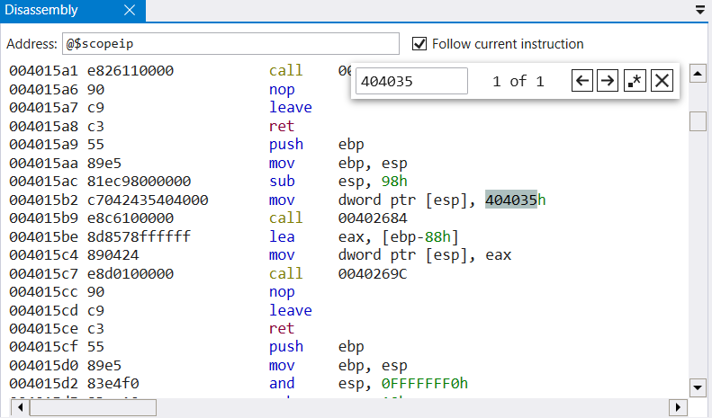

## Windows Pwn Python Venv Configuration

To add a path into the `sys.path` of a Python virtual environment, we need to add a .pth file containing the newline-separated paths to the `<venv_name>/Lib/site-packages` directory. 

E.g. 

```powershell
PS D:\CTFs\Python_Venvs\Windows_Pwn_Venv\Lib\site-packages> New-Item custom-paths.pth
PS D:\CTFs\Python_Venvs\Windows_Pwn_Venv\Lib\site-packages> Add-Content -Path custom-paths.pth -Value "D:\CTFs\Tools\Pwn\pwintools"
```

We could also use the cmdlet `Set-Content` to write to `custom-paths.pth`. 

## Finding the addresses of `vuln` and `win` in WinDbg without symbols from a `pdb` file

We have the [source code](./vuln.c), so we know that the string "Give" only exists in `main`. Thus we use the command `lm` to figure out the region of `vuln` 

```
0:000> lm
start    end        module name
00400000 0044b000   vuln       (service symbols: DWARF Private Symbols)        D:\CTFs\picoCTF\Pwn\wine\vuln.exe
75650000 756f6000   apphelp    (deferred)             
76040000 762b9000   KERNELBASE   (pdb symbols)          C:\ProgramData\Dbg\sym\wkernelbase.pdb\2200310A6E7D926FADD54212F1C6AD401\wkernelbase.pdb
76740000 76830000   KERNEL32   (pdb symbols)          C:\ProgramData\Dbg\sym\wkernel32.pdb\3B3998558694D03EC4EDD70D3848DD371\wkernel32.pdb
76830000 768f4000   msvcrt     (pdb symbols)          C:\ProgramData\Dbg\sym\msvcrt.pdb\34F7F72739101E3B219E5FC1E36B04351\msvcrt.pdb
77aa0000 77c52000   ntdll      (pdb symbols)          C:\ProgramData\Dbg\sym\wntdll.pdb\16D25128F0923461692F09D5A2DA14291\wntdll.pdb
```

before searching within that region for the string "Give"

```
0:000> s -a 0x400000 0x44b000 Give
00404035  47 69 76 65 20 6d 65 20-61 20 73 74 72 69 6e 67  Give me a string
```

Now we need to search for use of this address as a reference with

```
s -d 0x400000 0x44b000 0x404035
```

yielded no results, but manually selecting all of the disassembled instructions and Ctrl-A Ctrl-F through to carry out the search for "404035" worked (see below)



Thus the address of `vuln` is `0x4015a9`. Conducting a similar search for `win` yields the address `0x401530`. We can verify that these addresses are correct by setting `rip` to the address and observing program behavior from there. 

### Is the executable a PIE?

The above would pretty much be for naught if PIE is enabled. Luckily, from the headers, 

```
File Type: EXECUTABLE IMAGE
FILE HEADER VALUES
     14C machine (i386)
       F number of sections
660C1E5B time date stamp Tue Apr  2 23:03:55 2024

   3FC00 file pointer to symbol table
     4FA number of symbols
      E0 size of optional header
     107 characteristics
            Relocations stripped
            Executable
            Line numbers stripped
            32 bit word machine

OPTIONAL HEADER VALUES
     10B magic #
    2.34 linker version
    1800 size of code
    2C00 size of initialized data
     400 size of uninitialized data
    14C0 address of entry point
    1000 base of code
         ----- new -----
00400000 image base
    1000 section alignment
     200 file alignment
       3 subsystem (Windows CUI)
    4.00 operating system version
    1.00 image version
    4.00 subsystem version
   4B000 size of image
     400 size of headers
   4B52B checksum
00200000 size of stack reserve
00001000 size of stack commit
00100000 size of heap reserve
00001000 size of heap commit
       0  DLL characteristics
       0 [       0] address [size] of Export Directory
    6000 [     590] address [size] of Import Directory
       0 [       0] address [size] of Resource Directory
       0 [       0] address [size] of Exception Directory
       0 [       0] address [size] of Security Directory
       0 [       0] address [size] of Base Relocation Directory
       0 [       0] address [size] of Debug Directory
       0 [       0] address [size] of Description Directory
       0 [       0] address [size] of Special Directory
    4054 [      18] address [size] of Thread Storage Directory
       0 [       0] address [size] of Load Configuration Directory
       0 [       0] address [size] of Bound Import Directory
    6108 [      CC] address [size] of Import Address Table Directory
       0 [       0] address [size] of Delay Import Directory
       0 [       0] address [size] of COR20 Header Directory
       0 [       0] address [size] of Reserved Directory
```

we see that there is no indication of PIE, which would have looked something like 

```
OPTIONAL HEADER VALUES
...

          230 DLL characteristics
                    Dynamic base (ASLR)
                    NX compatible
                    No SEH
...
```